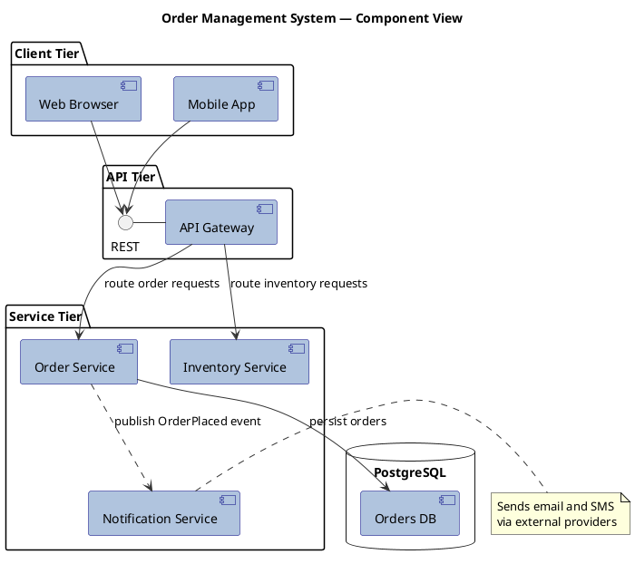
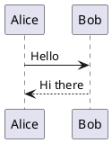

## Purpose

This skill teaches you to author, validate, and build PlantUML component diagrams and PlantUML sequence diagrams — the two most common diagram types for documenting software architecture and runtime behaviour.

Two helper scripts are available in every workspace:
| Script | Purpose |
| ------ | ------- |
| validate-plantuml.sh <file> |	Checks a .puml file for syntax errors, exits non-zero on failure |
| build-plantuml.sh <file> |	Renders a validated .puml file into a PNG/SVG image |

**Always validate before building.**


## Universal Syntax Rules

Every PlantUML file follows the same envelope:

```plantuml
@startuml [optional_diagram_name]

' Single-line comment
/' Multi-line
   comment '/

title My Diagram Title

' ... diagram body ...

@enduml
```



- @startuml / @enduml are required delimiters.
- Comments use ' (single-line) or /' ... '/ (block).
- title, header, and footer are optional but recommended.
- Colors can be named (red, LightBlue) or hex (#FF6655).
- Aliases are declared with as: component [Login Service] as LS.

## Part 1 — Component Diagrams

Component diagrams model the static structure of a system: its software and hardware components (modules, services, libraries, hosts, databases, etc) and how they connect.

### 1.1 Defining Components

Components are enclosed in square brackets or declared with the component keyword:

```plantuml

' Square-bracket shorthand
[Login Service]

' Keyword form (brackets optional if name has no spaces)
component AuthModule

' With alias
component [Payment Gateway] as PG
```

### 1.2 Defining Interfaces

Interfaces use parentheses () (resembling a lollipop circle) or the interface keyword:

```plantuml
() "REST API"
interface JDBC as db_iface

() HTTP
[Web Server] ..> () HTTP : uses
```

### 1.3 Relationship Syntax

Links use combinations of dashes, dots, and arrows:

| Syntax | Rendered as |
| ------ | ----------- |
| A -- B | Solid undirected line |
| A --> B | Solid directed arrow |
| A .. B | Dotted undirected line |
| A ..> B | Dotted directed arrow |
| A -left-> B | Directed with layout hint |
| A -[#red]-> B | Colored arrow |

Direction hints (-left-, -right-, -up-, -down-) guide the layout engine. Add a label with : text:

```plantuml

[Order Service] --> [Inventory Service] : check stock
[Order Service] ..> () "Messaging Bus" : publish event
```

### 1.4 Grouping / Packaging

Use container keywords to visually group elements:

```plantuml
package "Web Tier" {
  [Frontend App] as FE
  [API Gateway] as GW
}

node "App Server" {
  component [Business Logic] as BL
}

database "PostgreSQL" {
  [Orders DB]
}

cloud "AWS" {
  [S3 Bucket]
}

frame "Legacy System" {
  [Mainframe Adapter]
}

folder "Utilities" {
  [Logger]
}
```

Available grouping keywords: package, node, folder, frame, cloud, database, rectangle.

### 1.5 Stereotypes

Stereotypes add a label and can drive stereotype-specific skinparam styling:

```plantuml
component [Web Server] <<Apache>>
component [Cache] <<Redis>>
```

### 1.6 Notes

```plantuml
note left of [Login Service] : Handles OAuth 2.0
note right of [Payment Gateway] : PCI-DSS compliant
note top of [API Gateway]
  Central entry point
  for all clients
end note

' Standalone note linked with a dashed line
note "Floating note" as N1
[Login Service] .. N1
```

Available positions: left of, right of, top of, bottom of 2.

### 1.7 Skinparam Styling

```plantuml
skinparam component {
  BackgroundColor LightYellow
  BorderColor DarkBlue
  FontName Courier
  FontSize 13
  BackgroundColor<<Apache>> LightCoral
  BorderColor<<Apache>> #FF6655
  ArrowColor #444444
}

skinparam interface {
  BackgroundColor RosyBrown
  BorderColor orange
}
```

Skinparam blocks can target all components, or only those with a specific stereotype.

### 1.8 Complete Component Diagram Example



## Part 2 — Sequence Diagrams

Sequence diagrams model runtime interactions: the messages exchanged between participants over time, in order.

### 2.1 Basic Structure



Participants are auto-discovered on first mention — no explicit declaration needed for simple diagrams.

### 2.2 Declaring Participants

Explicit declaration gives control over order, shape, alias, color, and stereotype:

```plantuml
' Syntax: <keyword> "Label" as <alias> #color <<stereotype>>
participant "Order Service" as OS
actor       User             #LightBlue
boundary    "HTTP API"       as API
control     "Auth Manager"   as AM
entity      "Order"          as ORD
database    "PostgreSQL"     as DB
collections "Event Bus"      as EB
queue       "Job Queue"      as JQ
```

Available participant types and their shapes:

| Keyword | Shape |
| --- | --- |
| participant | Rectangle (default) |
| actor | Stick figure |
| boundary | Circle + vertical line |
| control | Circle + arrow |
| entity | Circle + horizontal line |
| database | Cylinder |
| collections | Overlapping rectangles |
| queue | Sideways cylinder |

The order of declaration sets the left-to-right display order.

Stereotypes are defined using << [(<letter>, <color>)] stereotype text >> within a participant definition.

### 2.3 Message (Arrow) Syntax

Line Style & Direction

| Arrow | Meaning |
| --- | --- |
| A -> B | Synchronous solid arrow |
| A --> B | Synchronous dotted (return/async) arrow |
| A ->> B | Solid thin (async) arrow |
| A -->> B | Dotted thin arrow |
| A <- B | Reverse (same layout, improved readability) |
| A <-- B | Reverse dotted |

Arrowhead Modifiers

| Example | Effect |
| --- | --- |
| A ->x B | Destruction / lost message (✕ at receiver) |
| A ->o B | Open circle arrowhead |
| A -\\ B | Half-top arrow |
| A -/ B | Half-bottom arrow |
| A ->] B | Short arrow to off-diagram target |
| [-> B | Short arrow from off-diagram source |

Colored Arrows

```plantuml

A -[#red]-> B: urgent call
A -[#0000FF]-->> B: async blue message
```
Message Labels

```plantuml
User -> API: POST /orders
API --> User: 201 Created
```

### 2.4 Activation (Lifeline) Bars

Show when a participant is actively processing:

```plantuml
' Explicit form
activate OrderService
OrderService -> DB: INSERT order
DB --> OrderService: OK
deactivate OrderService

' Shortcut inline suffixes on the target participant
User -> OS ++ : placeOrder()    ' activates OS
OS -> DB ++ : insert()          ' activates DB
DB --> OS -- : ack              ' deactivates DB
OS --> User -- : orderId        ' deactivates OS

' Create and destroy an instance
User -> OS ** : new             ' creates OS
OS ->x OS !! : shutdown         ' destroys OS
```

Shortcut suffixes:

++ — activate target
-- — deactivate source
** — create instance of target
!! — destroy instance of target

### 2.5 Return

return generates a return arrow back to the most-recent activating caller:

```plantuml

activate OS
OS -> DB: query
return result
````

### 2.6 Notes

```plantuml
' Notes on the most-recent arrow
User -> API: login
note left: Credentials validated here
note right
  Rate limited: max 5/minute
end note
```

```plantuml
' Notes relative to a participant
note left of API: Public-facing endpoint
note right of DB: Primary replica only
note over User, API: Both parties must use TLS 1.2+
```

Notes can be colored:

```plantuml
note right of API #LightYellow: Cache hit — no DB call
```

### 2.7 Grouping / Combined Fragments

Wrap messages in labelled blocks for conditional, looping, or parallel flows:

```plantuml
alt successful login
  User -> API: POST /login
  API --> User: 200 OK
else failed login
  API --> User: 401 Unauthorized
end

opt remember_me is true
  API -> DB: store session token
end

loop for each item in cart
  OS -> IS: checkStock(itemId)
end

par
  OS -> EmailService: sendConfirmation()
else
  OS -> SMSService: sendSMS()
end

break on network timeout
  API --> User: 503 Service Unavailable
end

critical
  OS -> DB: BEGIN TRANSACTION
  OS -> DB: UPDATE stock
  OS -> DB: COMMIT
end

group Custom Label [condition]
  A -> B: some call
end
```

Available group keywords: alt/else, opt, loop, par, break, critical, group.

### 2.8 References (ref)

Reference an external interaction or sub-diagram:

```plantuml

ref over User, API : See Authentication Flow diagram
```

### 2.9 Autonumbering

```plantuml
autonumber               ' 1, 2, 3 ...
autonumber 10            ' start at 10
autonumber 10 5          ' start at 10, increment by 5
autonumber "<b>[000]"    ' formatted: [010], [015] ...
autonumber stop          ' pause numbering
autonumber resume        ' resume from where paused
```

### 2.10 Dividers and Delays

```plantuml
== Initialization ==

User -> API: connect

...5 minutes later...

User -> API: ping

...

== text == draws a horizontal separator with a label. ... draws a delay gap; ...label... adds descriptive text.
2.11 Participant Box Grouping
plantuml

box "Front End" #LightBlue
  actor User
  participant Browser
end box

box "Back End" #LightGreen
  participant API
  database DB
end box
```

### 2.12 Title, Header, Footer

```plantuml
title Login Sequence — Happy Path
header Document version 1.2
footer Page %page% of %lastpage%
caption Figure 3: User authentication flow
```

### 2.13 Complete Sequence Diagram Example
```plantuml
@startuml place-order-sequence

title Place Order — Sequence Diagram
header System: Order Management Platform

autonumber

actor User
boundary "Web Browser" as Browser
participant "API Gateway" as GW
control "Order Service" as OS
database "Orders DB" as DB
collections "Event Bus" as EB

== Order Submission ==

User -> Browser: click "Place Order"
Browser -> GW: POST /api/orders
activate GW

alt request is authenticated

  GW -> OS ++ : placeOrder(payload)

  loop for each line item
    OS -> DB: checkInventory(itemId)
    DB --> OS: stockLevel
  end

  OS -> DB ++ : INSERT order
  DB --> OS -- : orderId

  OS -> EB: publish OrderPlaced event
  note right of EB
    Triggers downstream
    notifications and analytics
  end note

  return orderId

  GW --> Browser: 201 Created { orderId }

else request is unauthenticated

  GW --> Browser: 401 Unauthorized

end

deactivate GW

== Confirmation ==

...async processing...

EB -> OS: OrderPlaced event consumed
note over OS #LightYellow: Idempotency key checked here
OS -> DB: UPDATE order status = CONFIRMED

@enduml
```

## Part 3 — Workflow

### Step 1 — Write the Diagram

Create a .puml file using the syntax from Parts 1 or 2.

```bash
cat > login-flow.puml << 'EOF'
@startuml
actor User
User -> API: POST /login
API --> User: 200 OK + token
@enduml
EOF
```

### Step 2 — Validate

```bash
./validate-plantuml.sh login-flow.puml
```

- Exit code 0 → syntax is valid, proceed to build.
- Non-zero exit → fix the reported error and re-validate.

Common errors to watch for:
- Missing @enduml
- Unmatched end for a group block (alt, loop, etc.)
- Spaces or special characters in names without brackets or quotes
- Misspelled keywords (PlantUML keywords are case-sensitive)

### Step 3 — Build

```bash
./build-plantuml.sh login-flow.puml
```

This produces an image file (typically .png or .svg) in the same directory or a configured output folder.

### Step 4 — Iterate

If the rendered image doesn't look right:

- Add direction hints (-left->, -down->) to relationships in component diagrams.
- Reorder participant declarations in sequence diagrams to adjust left-to-right order.
- Apply skinparam to refine colors and fonts.
- Re-validate and rebuild after each change.

## Quick Reference Card

### Component Diagram

| Element | Syntax |
| --- | --- |
| Component | [Name] or component Name |
| Component with alias | component [Long Name] as LN |
| Interface | () "Name" or interface Name |
| Stereotype | [Name] <<stereotype>> |
| Solid directed link | A --> B |
| Dotted directed link | A ..> B |
| Link with label | A --> B : label |
| Package | package "Title" { ... } |
| Node | node "Title" { ... } |
| Cloud | cloud "Title" { ... } |
| Database | database "Title" { ... } |
| Note | note right of [X] : text |
| Styling | skinparam component { ... } |

###  Sequence Diagram

| Element | Syntax |
| --- | --- |
| Solid arrow | A -> B: label |
| Dotted arrow | A --> B: label |
| Async arrow | A ->> B: label |
| Colored arrow | A -[#red]-> B: label |
| Activate | activate A or A -> B ++ |
| Deactivate | deactivate A or B --> A -- |
| Return | return label |
| Create instance | A -> B ** |
| Destroy instance | A ->x B !! |
| Note on message | note left/right: text |
| Note on participant | note left of A: text |
| Note spanning | note over A, B: text |
| Alt/else | alt condition ... else ... end |
| Loop | loop N times ... end |
| Optional | opt condition ... end |
| Parallel | par ... else ... end |
| Break | break condition ... end |
| Divider | == Section Title == |
| Delay | ... or ...label... |
| Autonumber | autonumber |
| Box group | box "Title" #color ... end box |
| Reference | ref over A, B : label |
